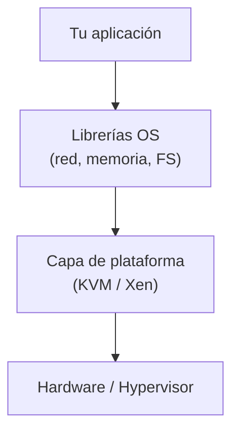
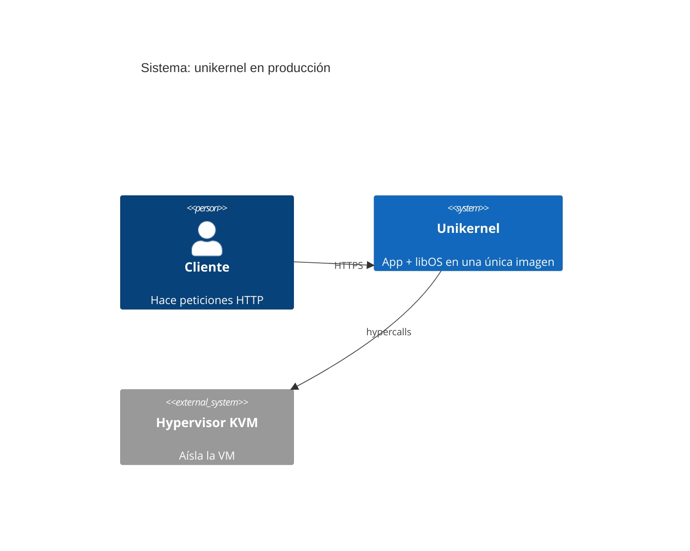
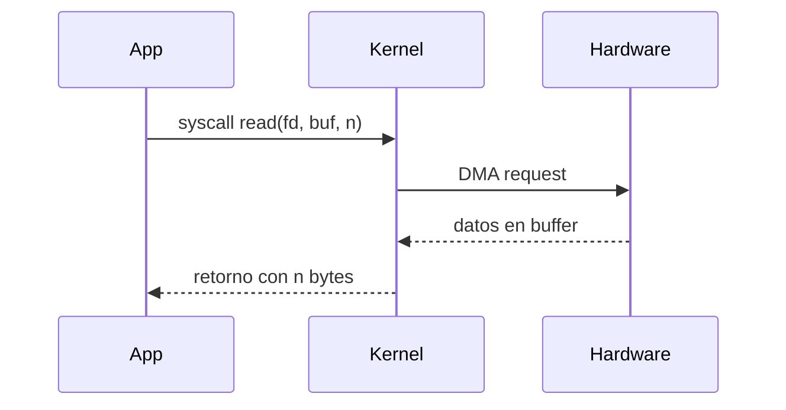

# Generar lección diaria del curso de unikernels

Genera el contenido completo de una lección del curso "Unikernels: De cero a experto".

## Uso

```
/leccion <número_de_día>
```

Ejemplo: `/leccion 7` genera la lección del día 7.

## Instrucciones

El argumento es: $ARGUMENTS

Sigue estos pasos:

### 1. Identificar la lección

Busca en el README.md la fila de la tabla que corresponde al día indicado en $ARGUMENTS para obtener:
- Título exacto de la lección
- Tipo (Lectura / Práctica / Repaso / Proyecto)
- Semana y Fase
- Nombre del archivo (columna "Lección")

Usa `grep` o `Read` sobre README.md para encontrar la línea `**Día $ARGUMENTS**`.

### 2. Determinar la carpeta destino

| Días | Carpeta |
|------|---------|
| 01–15 | `fase-1-fundamentos/` |
| 16–25 | `fase-2-concepto-unikernel/` |
| 26–40 | `fase-3-practica-nanos/` |
| 41–55 | `fase-4-practica-unikraft/` |
| 56–65 | `fase-5-seguridad-produccion/` |
| 66–80 | `fase-6-nivel-experto/` |

### 3. Generar el contenido

Escribe el archivo de lección con esta estructura exacta (sesión de 30 minutos):

```markdown
# Día NN — [Título]

> **Fase:** N · **Semana:** N · **Tipo:** [Lectura|Práctica|Repaso|Proyecto] · **Duración:** 30 min

---

## Contexto y motivación

[2-3 párrafos explicando POR QUÉ este tema importa en el contexto del curso.
Conecta con lo aprendido en lecciones anteriores y adelanta a qué lleva esto.]

---

## Concepto principal

[Explicación clara y densa del tema central. Para lecciones de lectura: teoría con
ejemplos concretos. Para práctica: el flujo de trabajo que se va a ejecutar.
Usa diagramas ASCII, tablas comparativas o fragmentos de código cuando aporten claridad.]

---

## Desarrollo (los 30 minutos)

### Parte 1 — [subtítulo] (~10 min)

[Contenido de la primera parte. Si es lectura: texto + ejemplos. Si es práctica: comandos
con salida esperada y explicación de cada paso.]

### Parte 2 — [subtítulo] (~15 min)

[Contenido de la segunda parte, la más densa.]

### Parte 3 — [subtítulo] (~5 min)

[Cierre: síntesis, conexión con la siguiente lección, o tarea pendiente mínima.]

---

## Puntos clave

- [punto 1]
- [punto 2]
- [punto 3]
- [punto 4]

---

## Preguntas de autoevaluación

1. [pregunta que verifica comprensión del concepto central]
2. [pregunta que exige aplicar lo aprendido]
3. [pregunta que conecta con otro tema del curso]

---

## Referencias

| Recurso | Por qué leerlo |
|---------|---------------|
| [nombre] | [motivo concreto] |

---

## Notas personales

> _Escribe aquí tus notas al estudiar esta lección._

---

*← [Día anterior: título] · [Día siguiente: título] →*
```

Adapta el contenido al tipo:
- **Lectura**: rico en teoría, diagramas, comparativas, citas de papers si aplica
- **Práctica**: cada comando con comentario, salida esperada, errores comunes
- **Repaso**: mapa mental textual + preguntas de autoevaluación más exigentes
- **Proyecto**: spec del entregable, criterios de éxito, pasos de implementación

---

## Guía de diagramas (GitHub los renderiza de forma nativa)

GitHub renderiza Mermaid directamente en archivos `.md`. Úsalo siempre que un diagrama aporte más que el texto.

### Cuándo usar cada tipo

| Tipo | Sintaxis | Cuándo usarlo en el curso |
|------|----------|--------------------------|
| Flowchart | `flowchart LR` | Flujos de ejecución, procesos de compilación, llamadas entre componentes |
| Sequence | `sequenceDiagram` | Syscalls, IPC entre procesos, protocolo de red |
| Architecture | `graph TD` | Capas de software (app → OS → hardware), arquitecturas |
| Mindmap | `mindmap` | Repasos, resumen de conceptos de una fase |
| C4 Context | `C4Context` | Vista de sistema: unikernel vs entorno exterior (hypervisor, red, disco) |
| C4 Container | `C4Container` | Componentes internos: app + libOS + plataforma |
| Gitgraph | `gitGraph` | Historial del proyecto o evolución de una tecnología |
| Timeline | `timeline` | Historia del OS, línea temporal de proyectos unikernel |
| Quadrant | `quadrantChart` | Comparativas de tecnologías por dos ejes (madurez vs facilidad, etc.) |

### Ejemplos listos para copiar

**Arquitectura en capas (flowchart):**
````markdown

````

**Diagrama C4 de contexto:**
````markdown

````

**Diagrama de secuencia (syscall):**
````markdown

````

### Reglas de uso

- Pon el diagrama **antes** del párrafo que lo explica, no después.
- Un diagrama por sección máximo; si necesitas más, el contenido pide dividirse.
- Los diagramas C4 son ideales para las fases 2–4 (arquitectura interna de unikernels).
- Los flowcharts y sequence son ideales para fases 1 y 3 (flujos y prácticas).
- Los mindmaps son obligatorios en las lecciones de tipo **Repaso**.

### 4. Escribir el archivo

Sobreescribe el placeholder existente en la carpeta correcta con el contenido generado.

### 5. Cerrar el issue de GitHub

Ejecuta:
```bash
gh issue close <número_del_día> --repo monghithub/unikernels --comment "Lección generada y guardada en el repositorio."
```

### 6. Confirmar al usuario

Informa:
- Ruta del archivo escrito
- Issue cerrado
- Título de la siguiente lección (día + 1) para que sepa qué sigue
