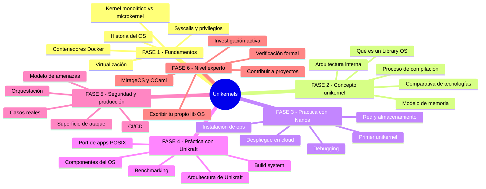
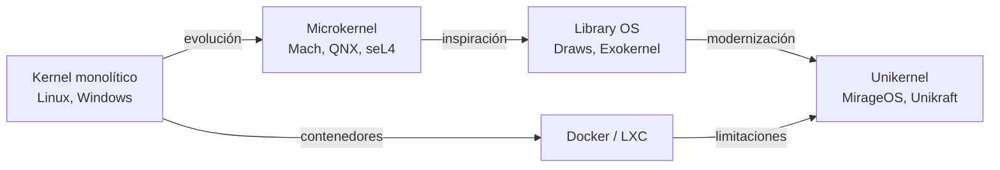
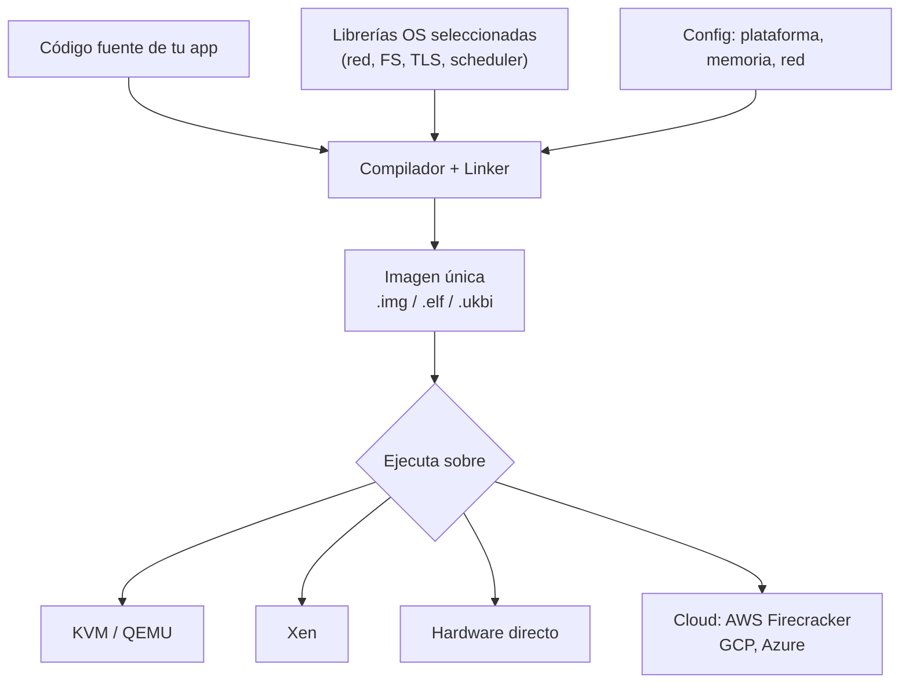
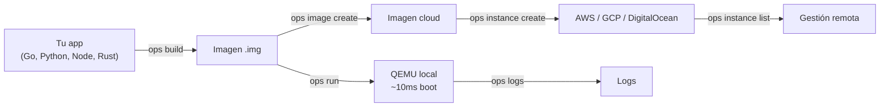
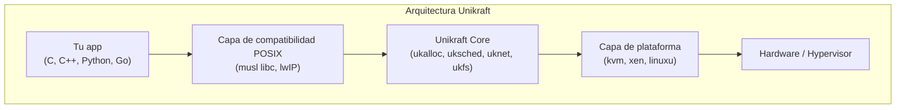
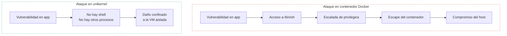
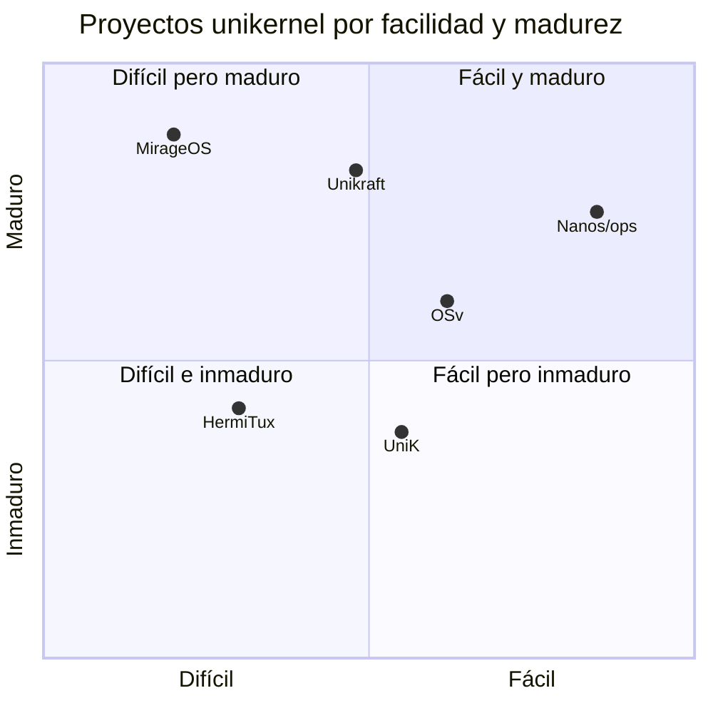
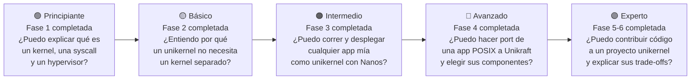

# Unikernels: De cero a experto

> Índice maestro de estudio con calendario para sesiones de 30 minutos, lunes a viernes.
> Cada lección diaria tiene su propio documento de profundización generado bajo demanda.

---

## Mapa general del temario

---

## Cómo usar esta guía

Este documento es tu **índice y hoja de ruta**. Cada sesión diaria tiene:

- Un tema concreto alcanzable en 30 minutos
- Una indicación de si es **lectura**, **práctica** o **proyecto**
- Una referencia al documento de lección individual que generarás cuando llegues a ese día

Para generar la lección de cualquier día, escribe:
> *"Genera la lección del día X: [título]"*

---

## Árbol completo de lecciones

```mermaid
graph TD
    Root["📚 Unikernels: De cero a experto"]

    Root --> F1["FASE 1\nFundamentos del OS\nSemanas 1-3"]
    Root --> F2["FASE 2\nConcepto unikernel\nSemanas 4-5"]
    Root --> F3["FASE 3\nPráctica con Nanos\nSemanas 6-8"]
    Root --> F4["FASE 4\nPráctica con Unikraft\nSemanas 9-11"]
    Root --> F5["FASE 5\nSeguridad y producción\nSemanas 12-13"]
    Root --> F6["FASE 6\nNivel experto\nSemanas 14-16"]

    F1 --> F1a["Sem 1: Historia y arquitecturas OS"]
    F1 --> F1b["Sem 2: Virtualización y contenedores"]
    F1 --> F1c["Sem 3: Library OS y contexto unikernel"]

    F2 --> F2a["Sem 4: Qué es un unikernel"]
    F2 --> F2b["Sem 5: Arquitectura interna"]

    F3 --> F3a["Sem 6: Nanos y ops CLI"]
    F3 --> F3b["Sem 7: Red, FS y configuración"]
    F3 --> F3c["Sem 8: Cloud y debugging"]

    F4 --> F4a["Sem 9: Unikraft introducción"]
    F4 --> F4b["Sem 10: Componentes internos"]
    F4 --> F4c["Sem 11: Port de apps y benchmarks"]

    F5 --> F5a["Sem 12: Seguridad en profundidad"]
    F5 --> F5b["Sem 13: Producción y orquestación"]

    F6 --> F6a["Sem 14: MirageOS y verificación formal"]
    F6 --> F6b["Sem 15: Internals y contribución"]
    F6 --> F6c["Sem 16: Proyecto final"]
```

---

## FASE 1 — Fundamentos del sistema operativo

> **Objetivo:** entender cómo funciona un OS moderno antes de ver qué elimina un unikernel.
> **Duración:** 3 semanas · 15 sesiones

### ¿Por qué esta fase?

No puedes entender qué elimina un unikernel si no sabes qué hay que eliminar. Esta fase te da el modelo mental del OS que los unikernels deconstruyen.

### Semana 1 — Historia y arquitecturas de OS

| Día | Sesión | Tipo | Lección |
|-----|--------|------|---------|
| L | **Día 01** — Qué es un kernel y para qué sirve | Lectura | `leccion-01-que-es-un-kernel.md` |
| M | **Día 02** — Kernel monolítico: Linux por dentro | Lectura | `leccion-02-kernel-monolitico.md` |
| X | **Día 03** — Microkernel: Mach, QNX y seL4 | Lectura | `leccion-03-microkernel.md` |
| J | **Día 04** — Espacio de usuario vs espacio de kernel | Lectura | `leccion-04-user-vs-kernel-space.md` |
| V | **Día 05** — Repaso semana 1 + mapa mental propio | Repaso | `leccion-05-repaso-semana-1.md` |

### Semana 2 — Syscalls, privilegios y virtualización

| Día | Sesión | Tipo | Lección |
|-----|--------|------|---------|
| L | **Día 06** — Syscalls: cómo habla una app con el kernel | Lectura | `leccion-06-syscalls.md` |
| M | **Día 07** — Rings de CPU: privilegios hardware (ring 0 a ring 3) | Lectura | `leccion-07-rings-cpu.md` |
| X | **Día 08** — Virtualización: tipo 1 vs tipo 2 | Lectura | `leccion-08-virtualizacion.md` |
| J | **Día 09** — KVM y QEMU: cómo funcionan | Lectura | `leccion-09-kvm-qemu.md` |
| V | **Día 10** — Xen hypervisor y paravirtualización | Lectura | `leccion-10-xen.md` |

### Semana 3 — Contenedores y Library OS

| Día | Sesión | Tipo | Lección |
|-----|--------|------|---------|
| L | **Día 11** — Docker por dentro: namespaces y cgroups | Lectura | `leccion-11-docker-internals.md` |
| M | **Día 12** — Limitaciones de seguridad en contenedores | Lectura | `leccion-12-limitaciones-docker.md` |
| X | **Día 13** — Library OS: Exokernel, Drawbridge, Biscuit | Lectura | `leccion-13-library-os.md` |
| J | **Día 14** — Paper fundacional: Madhavapeddy 2013 (lectura guiada) | Lectura | `leccion-14-paper-madhavapeddy.md` |
| V | **Día 15** — Repaso fase 1 + autoevaluación | Repaso | `leccion-15-repaso-fase-1.md` |

---

## FASE 2 — El concepto unikernel

> **Objetivo:** entender qué es un unikernel, cómo está construido por dentro y por qué es diferente.
> **Duración:** 2 semanas · 10 sesiones

### Semana 4 — Qué es un unikernel

| Día | Sesión | Tipo | Lección |
|-----|--------|------|---------|
| L | **Día 16** — Definición formal de unikernel | Lectura | `leccion-16-definicion-unikernel.md` |
| M | **Día 17** — Comparativa: proceso nativo / Docker / VM / unikernel | Lectura | `leccion-17-comparativa-tecnologias.md` |
| X | **Día 18** — Ventajas: tamaño, boot time, seguridad, performance | Lectura | `leccion-18-ventajas-unikernels.md` |
| J | **Día 19** — Desventajas y limitaciones reales | Lectura | `leccion-19-limitaciones-unikernels.md` |
| V | **Día 20** — Cuándo usar (y cuándo no usar) unikernels | Lectura | `leccion-20-cuando-usar-unikernels.md` |

### Semana 5 — Arquitectura interna

| Día | Sesión | Tipo | Lección |
|-----|--------|------|---------|
| L | **Día 21** — Componentes internos: boot stub, scheduler, pila de red | Lectura | `leccion-21-componentes-internos.md` |
| M | **Día 22** — Modelo de memoria: sin separación ring 0/3 | Lectura | `leccion-22-modelo-memoria.md` |
| X | **Día 23** — Proceso de compilación estática y linkado | Lectura | `leccion-23-compilacion-estatica.md` |
| J | **Día 24** — Formatos de imagen: .img, .elf, .ukbi, .iso | Lectura | `leccion-24-formatos-imagen.md` |
| V | **Día 25** — Repaso fase 2 + autoevaluación | Repaso | `leccion-25-repaso-fase-2.md` |

---

## FASE 3 — Práctica con Nanos y ops

> **Objetivo:** tener experiencia práctica real ejecutando aplicaciones como unikernels.
> **Duración:** 3 semanas · 15 sesiones

### Semana 6 — Primeros pasos con Nanos

| Día | Sesión | Tipo | Lección |
|-----|--------|------|---------|
| L | **Día 26** — Instalar ops CLI y QEMU | Práctica | `leccion-26-instalar-ops.md` |
| M | **Día 27** — Primer unikernel: hello world en Go | Práctica | `leccion-27-hello-world-go.md` |
| X | **Día 28** — App Python como unikernel | Práctica | `leccion-28-python-unikernel.md` |
| J | **Día 29** — App Node.js como unikernel | Práctica | `leccion-29-nodejs-unikernel.md` |
| V | **Día 30** — Explorar la imagen generada con `ops image ls` | Práctica | `leccion-30-explorar-imagen.md` |

### Semana 7 — Red, almacenamiento y configuración

| Día | Sesión | Tipo | Lección |
|-----|--------|------|---------|
| L | **Día 31** — Configurar red: puertos, IP, DNS en Nanos | Práctica | `leccion-31-red-nanos.md` |
| M | **Día 32** — Servidor HTTP estático como unikernel | Práctica | `leccion-32-servidor-http.md` |
| X | **Día 33** — Montar volúmenes y sistema de archivos | Práctica | `leccion-33-volumen-fs.md` |
| J | **Día 34** — Variables de entorno y configuración en config.json | Práctica | `leccion-34-config-json.md` |
| V | **Día 35** — Medir y comparar: tamaño de imagen y tiempo de boot | Práctica | `leccion-35-medir-metricas.md` |

### Semana 8 — Cloud y debugging

| Día | Sesión | Tipo | Lección |
|-----|--------|------|---------|
| L | **Día 36** — Desplegar en DigitalOcean con ops | Práctica | `leccion-36-deploy-digitalocean.md` |
| M | **Día 37** — Gestionar instancias: crear, listar, eliminar | Práctica | `leccion-37-gestionar-instancias.md` |
| X | **Día 38** — Debugging con ops logs y consola serie | Práctica | `leccion-38-debugging-nanos.md` |
| J | **Día 39** — Qué pasa cuando algo falla: errores comunes | Práctica | `leccion-39-errores-comunes-nanos.md` |
| V | **Día 40** — Proyecto: API REST simple en unikernel | Proyecto | `leccion-40-proyecto-api-rest.md` |

---

## FASE 4 — Práctica con Unikraft

> **Objetivo:** entender los internos del OS a nivel de componentes y poder construir unikernels a medida.
> **Duración:** 3 semanas · 15 sesiones

### Semana 9 — Introducción a Unikraft

| Día | Sesión | Tipo | Lección |
|-----|--------|------|---------|
| L | **Día 41** — Instalar kraft CLI y entorno de desarrollo | Práctica | `leccion-41-instalar-unikraft.md` |
| M | **Día 42** — Arquitectura de Unikraft: core, plataformas, librerías | Lectura | `leccion-42-arquitectura-unikraft.md` |
| X | **Día 43** — Tutorial oficial: helloworld con kraft | Práctica | `leccion-43-helloworld-unikraft.md` |
| J | **Día 44** — El sistema de build: Kconfig y Makefiles | Lectura | `leccion-44-build-system.md` |
| V | **Día 45** — Plataformas: kvm vs xen vs linuxu | Lectura | `leccion-45-plataformas.md` |

### Semana 10 — Componentes internos del OS

| Día | Sesión | Tipo | Lección |
|-----|--------|------|---------|
| L | **Día 46** — ukalloc: gestión de memoria en Unikraft | Lectura | `leccion-46-ukalloc.md` |
| M | **Día 47** — uksched: scheduler cooperativo vs apropiativo | Lectura | `leccion-47-uksched.md` |
| X | **Día 48** — uknet y lwIP: pila de red ligera | Lectura | `leccion-48-uknet-lwip.md` |
| J | **Día 49** — ukfs: sistemas de archivos en Unikraft (9P, ramfs) | Lectura | `leccion-49-ukfs.md` |
| V | **Día 50** — Seleccionar y combinar componentes a medida | Práctica | `leccion-50-seleccionar-componentes.md` |

### Semana 11 — Port de apps y benchmarking

| Día | Sesión | Tipo | Lección |
|-----|--------|------|---------|
| L | **Día 51** — Port de app POSIX a Unikraft: proceso paso a paso | Práctica | `leccion-51-port-app-posix.md` |
| M | **Día 52** — Depurar con plataforma linuxu y GDB | Práctica | `leccion-52-debug-gdb.md` |
| X | **Día 53** — Optimizar tamaño de imagen: strip, LTO, musl | Práctica | `leccion-53-optimizar-tamano.md` |
| J | **Día 54** — Benchmarking: latencia, throughput, uso de memoria | Práctica | `leccion-54-benchmarking.md` |
| V | **Día 55** — Proyecto: servidor Nginx como unikernel con Unikraft | Proyecto | `leccion-55-proyecto-nginx.md` |

---

## FASE 5 — Seguridad y producción

> **Objetivo:** entender el modelo de seguridad real, limitaciones y cómo llevar unikernels a producción.
> **Duración:** 2 semanas · 10 sesiones

### Semana 12 — Seguridad en profundidad

| Día | Sesión | Tipo | Lección |
|-----|--------|------|---------|
| L | **Día 56** — Modelo de amenazas: superficie de ataque comparada | Lectura | `leccion-56-modelo-amenazas.md` |
| M | **Día 57** — CVEs famosos en contenedores que no aplican a unikernels | Lectura | `leccion-57-cves-contenedores.md` |
| X | **Día 58** — Limitaciones de seguridad propias de unikernels | Lectura | `leccion-58-limitaciones-seguridad.md` |
| J | **Día 59** — TLS sin capa extra: crypto dentro del unikernel | Lectura | `leccion-59-tls-unikernel.md` |
| V | **Día 60** — AWS Firecracker: microVMs y su relación con unikernels | Lectura | `leccion-60-firecracker.md` |

### Semana 13 — Producción y orquestación

| Día | Sesión | Tipo | Lección |
|-----|--------|------|---------|
| L | **Día 61** — Unikernels en serverless / FaaS: casos reales | Lectura | `leccion-61-unikernels-serverless.md` |
| M | **Día 62** — Unikernels en IoT y edge computing | Lectura | `leccion-62-unikernels-iot.md` |
| X | **Día 63** — ¿Orquestación con Kubernetes? Alternativas actuales | Lectura | `leccion-63-orquestacion.md` |
| J | **Día 64** — Integración en pipelines CI/CD (GitHub Actions, GitLab) | Práctica | `leccion-64-cicd.md` |
| V | **Día 65** — Casos de fallo en producción: lecciones aprendidas | Lectura | `leccion-65-casos-fallo.md` |

---

## FASE 6 — Nivel experto

> **Objetivo:** dominar los internos del ecosistema, contribuir a proyectos y producir trabajo original.
> **Duración:** 3 semanas · 15 sesiones

### Semana 14 — MirageOS y verificación formal

| Día | Sesión | Tipo | Lección |
|-----|--------|------|---------|
| L | **Día 66** — OCaml en 30 minutos: lo mínimo para MirageOS | Lectura | `leccion-66-ocaml-minimo.md` |
| M | **Día 67** — Arquitectura de MirageOS: functors y módulos | Lectura | `leccion-67-arquitectura-mirageos.md` |
| X | **Día 68** — Tutorial MirageOS: unikernel estático con Cohttp | Práctica | `leccion-68-tutorial-mirageos.md` |
| J | **Día 69** — seL4: verificación formal de un microkernel | Lectura | `leccion-69-sel4.md` |
| V | **Día 70** — Investigación activa: papers 2022-2025 sobre unikernels | Lectura | `leccion-70-papers-recientes.md` |

### Semana 15 — Internals y contribución open source

| Día | Sesión | Tipo | Lección |
|-----|--------|------|---------|
| L | **Día 71** — Cómo leer código fuente de un lib OS | Lectura | `leccion-71-leer-codigo-fuente.md` |
| M | **Día 72** — Boot en x86: de UEFI/BIOS al entry point del unikernel | Lectura | `leccion-72-boot-x86.md` |
| X | **Día 73** — WebAssembly como alternativa a unikernels: comparativa | Lectura | `leccion-73-wasm-vs-unikernel.md` |
| J | **Día 74** — Cómo contribuir a Unikraft o Nanos: flujo de PR | Práctica | `leccion-74-contribuir-oss.md` |
| V | **Día 75** — Escribir un mini lib OS desde cero (parte 1): boot | Práctica | `leccion-75-mini-libos-boot.md` |

### Semana 16 — Proyecto final

| Día | Sesión | Tipo | Lección |
|-----|--------|------|---------|
| L | **Día 76** — Escribir un mini lib OS desde cero (parte 2): IO | Práctica | `leccion-76-mini-libos-io.md` |
| M | **Día 77** — Proyecto final: definir y comenzar | Proyecto | `leccion-77-proyecto-final-inicio.md` |
| X | **Día 78** — Proyecto final: implementar | Proyecto | `leccion-78-proyecto-final-impl.md` |
| J | **Día 79** — Proyecto final: documentar y publicar | Proyecto | `leccion-79-proyecto-final-doc.md` |
| V | **Día 80** — Repaso general, próximos pasos y comunidades | Repaso | `leccion-80-cierre.md` |

---

## Calendario visual por semanas

| Semana | Fase | Tema central | Lunes | Martes | Miércoles | Jueves | Viernes |
|--------|------|--------------|-------|--------|-----------|--------|---------|
| 1 | F1 | Historia y arquitecturas OS | D01 | D02 | D03 | D04 | D05 |
| 2 | F1 | Syscalls, rings y virtualización | D06 | D07 | D08 | D09 | D10 |
| 3 | F1 | Contenedores y Library OS | D11 | D12 | D13 | D14 | D15 |
| 4 | F2 | Qué es un unikernel | D16 | D17 | D18 | D19 | D20 |
| 5 | F2 | Arquitectura interna | D21 | D22 | D23 | D24 | D25 |
| 6 | F3 | Primeros pasos con Nanos | D26 | D27 | D28 | D29 | D30 |
| 7 | F3 | Red, almacenamiento, config | D31 | D32 | D33 | D34 | D35 |
| 8 | F3 | Cloud y debugging | D36 | D37 | D38 | D39 | D40 |
| 9 | F4 | Introducción a Unikraft | D41 | D42 | D43 | D44 | D45 |
| 10 | F4 | Componentes internos del OS | D46 | D47 | D48 | D49 | D50 |
| 11 | F4 | Port de apps y benchmarks | D51 | D52 | D53 | D54 | D55 |
| 12 | F5 | Seguridad en profundidad | D56 | D57 | D58 | D59 | D60 |
| 13 | F5 | Producción y orquestación | D61 | D62 | D63 | D64 | D65 |
| 14 | F6 | MirageOS y verificación formal | D66 | D67 | D68 | D69 | D70 |
| 15 | F6 | Internals y contribución OSS | D71 | D72 | D73 | D74 | D75 |
| 16 | F6 | Proyecto final | D76 | D77 | D78 | D79 | D80 |

---

## Autoevaluación por nivel

Al final de cada fase, hazte estas preguntas para confirmar que puedes avanzar:

---

## Recursos de referencia

### Libros y papers

| Recurso | Relevante para | Enlace |
|---------|---------------|--------|
| OSTEP — Operating Systems: Three Easy Pieces | Fase 1 | ostep.org |
| Madhavapeddy et al. 2013 — Unikernels paper | Fase 2 | dl.acm.org |
| Kuenzer et al. 2021 — Unikraft paper | Fase 4 | dl.acm.org |
| The Design and Implementation of the Anykernel | Fase 1-2 | pdos.csail.mit.edu |
| seL4: Formal Verification of an OS Kernel | Fase 6 | sel4.systems |

### Documentación oficial

| Proyecto | URL |
|---------|-----|
| Nanos / ops | ops.city/docs |
| Unikraft | unikraft.org/docs |
| MirageOS | mirage.io/docs |
| OSv | github.com/cloudius-systems/osv |
| Firecracker | firecracker-microvm.github.io |

### Comunidades

| Comunidad | Dónde |
|-----------|-------|
| Unikraft Slack | app.slack.com/unikraft |
| Nanos Discord | discord.gg/nanos |
| MirageOS Discuss | discuss.ocaml.org |
| Reddit r/osdev | reddit.com/r/osdev |

---

## Glosario

| Término | Definición |
|---------|-----------|
| **Library OS** | OS donde cada app incluye su propia copia de los servicios del sistema |
| **Unikernel** | Imagen única: app + librerías OS compiladas, sin SO separado |
| **Hypervisor** | Software que gestiona VMs (KVM, Xen, VMware ESXi) |
| **Bare metal** | Ejecución directa sobre hardware, sin virtualización |
| **Syscall** | Llamada de un proceso al kernel para servicios del OS |
| **Ring 0 / Ring 3** | Niveles de privilegio de CPU (0 = kernel, 3 = usuario) |
| **Boot stub** | Código mínimo de arranque que inicializa el entorno antes de la app |
| **POSIX** | Estándar de interfaz OS: syscalls, FS, señales, procesos |
| **lwIP** | Implementación ligera de la pila TCP/IP, usada en Unikraft |
| **Firecracker** | Hypervisor ultraligero de AWS, base de Lambda y Fargate |
| **kraft** | CLI oficial de Unikraft para build, configuración y run |
| **ops** | CLI de Nanos para compilar, empaquetar y desplegar unikernels |
| **musl libc** | Implementación ligera de la librería C estándar, compatible POSIX |
| **9P** | Protocolo de sistema de archivos en red, usado por Unikraft |
| **LTO** | Link-Time Optimization: optimización en tiempo de linkado |
| **unikernel sprawl** | Proliferación descontrolada de imágenes unikernel sin gestión |

---

*Para generar la lección de cualquier día escribe: "Genera la lección del día N: [título]"*
*Guía creada con Claude Sonnet · Versión 1.0*
