# Anexo 03 — Arquitecturas de OS: del Kernel Monolítico al Unikernel

> **Relacionado con:** [Día 03 — Microkernel](leccion-03-microkernel.md)  
> **Nivel:** Tres capas explicativas — básica · intermedia · avanzada  
> **Formato:** Diagramas Mermaid (C4 + flujos) + glosario completo

---

## Introducción: el espectro de diseño

Existe un eje fundamental en el diseño de sistemas operativos:

```
¿Cuánto código corre con privilegios máximos (ring 0)?
```

Cada arquitectura responde de forma diferente a esa pregunta, y esa respuesta determina su rendimiento, resiliencia, seguridad y tamaño:

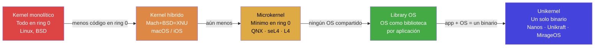

Las flechas significan "menos código privilegiado, más aislamiento lógico de componentes". No hay una opción objetivamente mejor: cada punto del espectro resuelve un conjunto distinto de problemas.

---

## Nivel 1 — Explicación básica: la analogía del restaurante

### La cocina como kernel

Piensa en un sistema operativo como un restaurante:

- **El cliente** es tu aplicación (una app Go, un servidor web, un proceso de base de datos).
- **El camarero** es la interfaz del sistema operativo (la API / syscalls).
- **La cocina** es el kernel: el lugar donde ocurre el trabajo real con los recursos (CPU, memoria, disco, red = los ingredientes y fogones).
- **Los cocineros especializados** son los drivers de dispositivo.

Cada arquitectura organiza esa cocina de forma diferente:

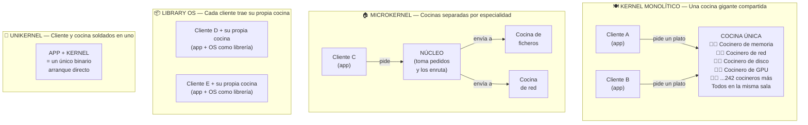

**Diferencias clave en lenguaje de restaurante:**

| Arquitectura | Si un cocinero se envenena... | Cuánto pesa la cocina | Para quién es |
|---|---|---|---|
| Monolítico | Todo el restaurante cierra | Enorme (37 M LOC) | Propósito general |
| Microkernel | Solo esa cocina falla; el restaurante sigue | Pequeño (miles de LOC en núcleo) | Sistemas críticos |
| Library OS | Solo ese cliente se enferma | Variable (lleva lo que necesita) | Rendimiento aislado |
| Unikernel | Solo esa instancia cae; otras están bien | Mínimo (lo que la app usa) | Cloud, microservicios |

---

### El problema de la frontera

En la cocina (kernel space) se puede tocar el gas, la electricidad y los cuchillos de carnicero (hardware). En la sala de clientes (user space) eso no está permitido por seguridad.

Para pedir algo de la cocina, el camarero lleva el pedido: eso es una **syscall**. Cada ida y vuelta del camarero cuesta tiempo.

Un **unikernel** hace al cliente y al cocinero la misma persona: cocina en su propia casa. No hay camarero, no hay viaje de ida y vuelta. Pero si mete el dedo en el aceite hirviendo, no hay nadie que lo proteja.

---

## Nivel 2 — Explicación intermedia: arquitectura de componentes

### C4 Nivel 1 — Contexto del sistema (qué hace cada arquitectura)

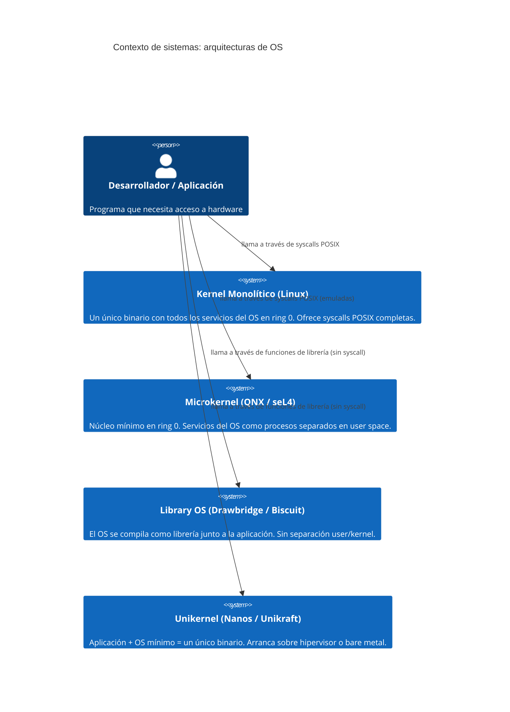

---

### C4 Nivel 2 — Contenedores: componentes internos

#### Kernel monolítico

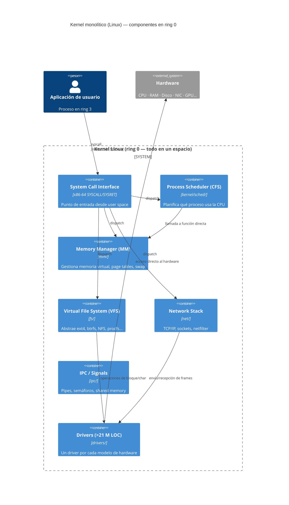

#### Microkernel

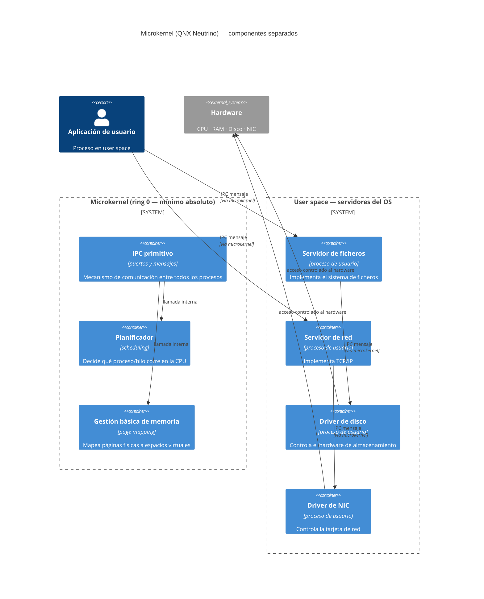

#### Library OS y Unikernel

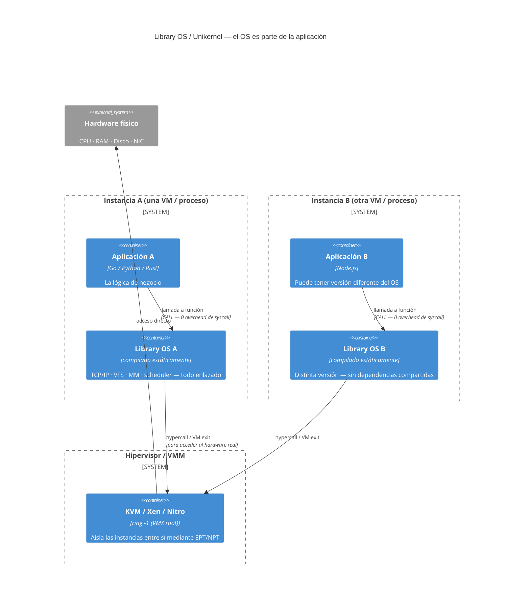

---

### Flujos de una operación de red: comparativa

Cuántos pasos necesita cada arquitectura para enviar un paquete TCP:

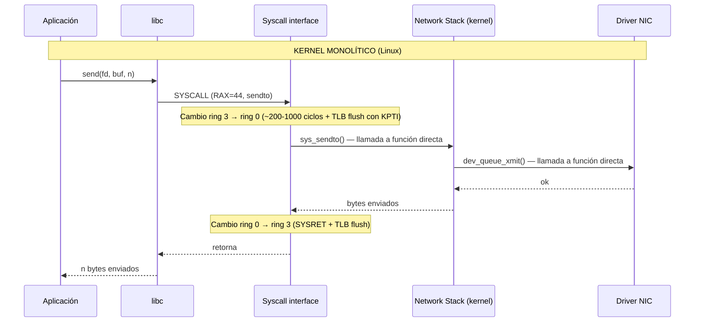

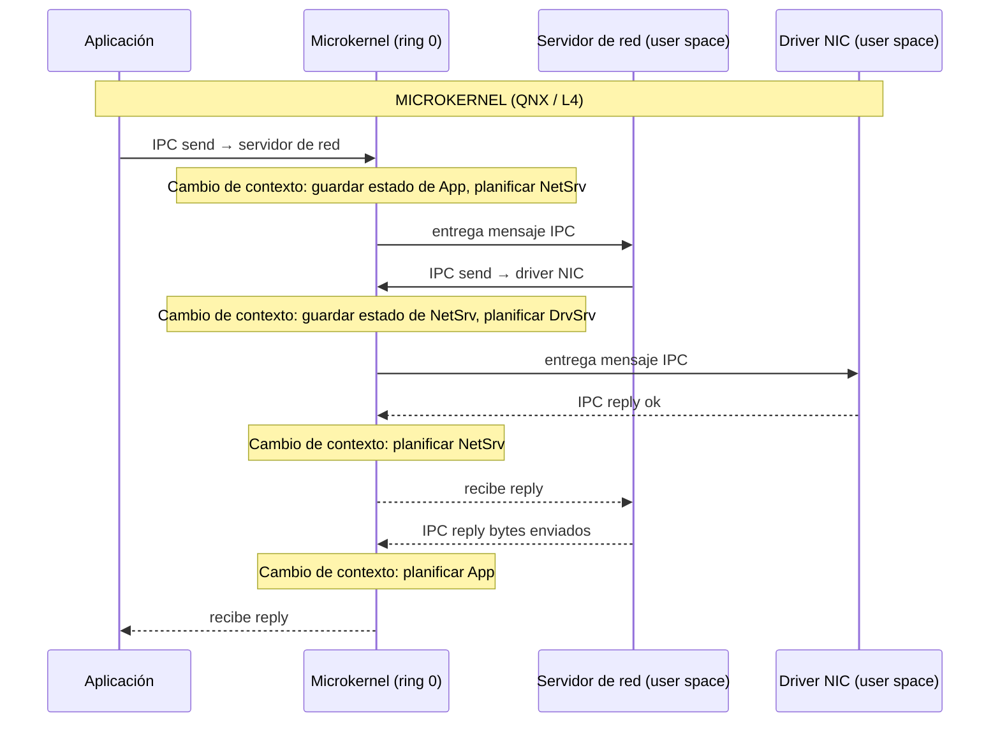

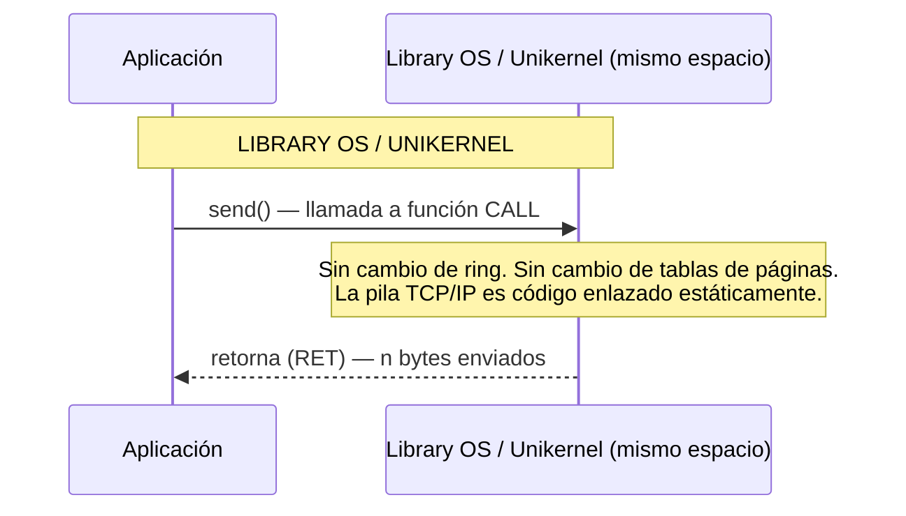

**Coste comparativo por operación de red:**

| Arquitectura | Cambios de ring | Cambios de contexto | Flushes de TLB | Overhead estimado |
|---|---|---|---|---|
| Monolítico (Linux + KPTI) | 2 | 0 | 2 | 500–3.000 ciclos |
| Microkernel | 2–4 | 4–6 | 4–6 | 2.000–10.000 ciclos |
| Library OS / Unikernel | 0 | 0 | 0 | ~1 ciclo (`CALL`) |

---

## Nivel 3 — Explicación avanzada: memoria, IPC y trade-offs reales

### Mapa de memoria: cuatro arquitecturas, cuatro mundos

```mermaid
graph TD
    subgraph MONO_MEM["Kernel monolítico — espacio de memoria"]
        direction TB
        M1["0xFFFF... — tope kernel space"]
        M2["módulos .ko cargados\n(ring 0 — ring 0)"]
        M3["vmalloc / ioremap"]
        M4["memoria física mapeada directamente"]
        M5["texto/datos del kernel · stacks de CPU"]
        M6["0xFFFF800000000000 — base kernel space"]
        M7["── agujero canónico ──"]
        M8["0x00007FFF... — tope user space"]
        M9["stack del proceso (crece ↓)"]
        M10["mmap / bibliotecas compartidas"]
        M11["heap (crece ↑)"]
        M12["BSS · data · text"]
        M13["0x0000000000400000 — base ejecutable"]
        M14["página nula — nunca mapeada"]
    end

    subgraph UNI_MEM["Unikernel — espacio de memoria (plano)"]
        direction TB
        U1["Un único espacio de direcciones"]
        U2["Stack de la aplicación"]
        U3["Heap de la aplicación"]
        U4["Código de la aplicación"]
        U5["Stack del 'kernel' (pila de red, VFS…)"]
        U6["Código de drivers / libOS"]
        U7["Sin separación ring 3 / ring 0\nTodo en ring 0 o ring 1 (según VMM)"]
    end
```

---

### El mecanismo IPC de L4 / seL4: por qué es rápido

Los microkernels modernos (familia L4) optimizaron el IPC hasta el límite físico. En seL4, una llamada IPC síncrona tarda **~100 nanosegundos** (en hardware moderno), comparable a una syscall de Linux sin KPTI. ¿Cómo lo logran?

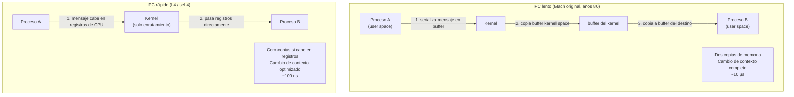

La clave del IPC rápido: si el mensaje cabe en los registros de la CPU (RDI, RSI, RDX, R10, R8, R9 — los mismos que usa Linux para syscalls), no hay copia de memoria en absoluto. El kernel enruta el mensaje cambiando cuál proceso está ejecutando, pero los datos ya están en los registros del destinatario.

---

### El modelo de capacidades (capabilities): seL4 y su influencia

seL4 introduce un mecanismo de seguridad que va más allá de los rings de CPU: el **sistema de capacidades** (capability system).

```mermaid
graph TD
    subgraph CAP["Sistema de capacidades de seL4"]
        INIT["Proceso init\n(tiene todas las capacidades al arrancar)"]
        CAP_FS["Capacidad: acceso a disco"]
        CAP_NET["Capacidad: acceso a NIC"]
        CAP_MEM["Capacidad: 256 MB de RAM"]

        SRV_FS["Servidor de ficheros\n(solo tiene cap. disco)"]
        SRV_NET["Servidor de red\n(solo tiene cap. NIC + mem)"]
        APP["Aplicación\n(capacidad de IPC con servidores)"]

        INIT -->|delega cap. disco| SRV_FS
        INIT -->|delega cap. NIC + mem| SRV_NET
        INIT -->|delega IPC con servidores| APP
        APP -->|IPC (verificado por kernel)| SRV_FS
        APP -->|IPC (verificado por kernel)| SRV_NET
    end

    RULE["Regla: ningún proceso puede obtener acceso\na un recurso sin que init (o su delegado)\nle haya concedido explícitamente la capacidad"]
    style RULE fill:#228,color:#fff
```

Este modelo influye directamente en los unikernels modernos: Unikraft usa un sistema de componentes con interfaces bien definidas; MirageOS usa el sistema de tipos de OCaml como mecanismo de capacidades en tiempo de compilación.

---

### Comparativa técnica completa

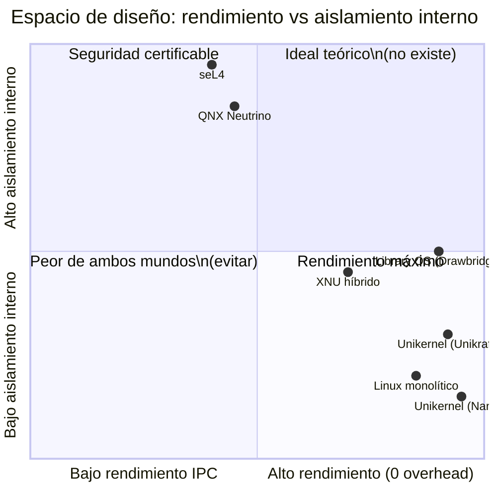

> **Nota**: "Aislamiento interno" mide el aislamiento entre componentes del propio OS (no entre VMs distintas, que lo proporciona el hipervisor en todos los casos). Un unikernel tiene aislamiento externo alto (hipervisor) pero aislamiento interno nulo (un único espacio de memoria).

---

### Trade-offs en profundidad: tabla maestra

| Dimensión | Monolítico (Linux) | Microkernel (seL4) | Library OS | Unikernel (Nanos) |
|---|---|---|---|---|
| **Código en ring 0** | Todo (~37 M LOC) | Solo IPC + sched + MM (~10 K LOC) | Variable (app decide) | Solo el necesario (app decide) |
| **Coste de syscall** | 100–3.000 ciclos (+ KPTI) | ~100 ns (IPC L4) | ~1 ciclo (CALL) | ~1 ciclo (CALL) |
| **Fallo en driver** | Kernel panic (sistema entero) | Muere el servidor; el sistema sigue | Muere la instancia | Muere la instancia |
| **Verificabilidad formal** | Imposible a escala | Demostrado (seL4) | No aplicable | Teóricamente posible |
| **Tamaño de imagen** | 15–16 MB (comprimida) | 300 KB – 2 MB | 5–20 MB | 1–5 MB (app incluida) |
| **Tiempo de arranque** | 1–5 s (VM) | 50–500 ms | 10–100 ms | 5–100 ms |
| **Compatibilidad POSIX** | Total (es la referencia) | Parcial (via servidor) | Parcial (libc modificada) | Parcial (libc mínima) |
| **Nº de procesos** | Ilimitado | Ilimitado | Varios posibles | Habitualmente 1 |
| **Drivers disponibles** | ~21 M LOC (todo hardware) | Driver = proceso de usuario | Los que se compilan | Los que se compilan |
| **Aislamiento entre instancias** | Processes + namespaces | Processes + namespaces | Hipervisor o contenedor | Hipervisor (obligatorio) |
| **Casos de uso típicos** | Servidores, escritorio, Android | Aviónica, automoción, médico | Investigación, HPC | Cloud, serverless, microservicios |
| **Ejemplos reales** | Linux, FreeBSD, Solaris | QNX, seL4, L4, Zircon | Drawbridge, Biscuit, Graphene | Nanos, Unikraft, MirageOS |

---

### El camino histórico: cómo llegamos al unikernel

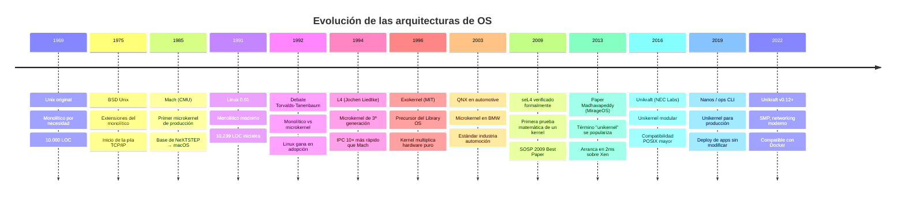

---

## Glosario de términos técnicos

> Los términos marcados con **★** son fundamentales y aparecerán repetidamente en el curso.

---

### A

**Agujero canónico** *(canonical hole)*  
Región del espacio de direcciones virtuales en x86-64 entre `0x0000800000000000` y `0xFFFF7FFFFFFFFFFF` que no puede ser utilizada. Existe porque los procesadores x86-64 solo implementan 48 bits de espacio de direcciones pero trabajan con punteros de 64 bits; los bits 48–63 deben ser todos iguales al bit 47. Las direcciones que no cumplen esa regla son no canónicas y el hardware lanza una excepción (#GP) al acceder a ellas.

**API** *(Application Programming Interface)*  
Conjunto de funciones, protocolos o herramientas que una pieza de software expone para que otras puedan usarla. En el contexto de kernels, la API principal es la interfaz de syscalls.

**ARM** *(Advanced RISC Machine)*  
Familia de arquitecturas de procesador ampliamente usada en dispositivos móviles (Android, iOS), servidores (AWS Graviton) y sistemas embebidos. Los conceptos de ring 0/ring 3 se mapean en ARM como EL0 (Exception Level 0, equivalente a ring 3) y EL1/EL2 (equivalente a ring 0 / hipervisor).

---

### B

**bare metal** *(metal desnudo)*  
Ejecución de software directamente sobre el hardware físico sin ninguna capa de sistema operativo ni hipervisor entre medias. Un unikernel que arranca sobre bare metal no necesita un hipervisor, pero pierde el aislamiento que este proporciona.

**binario estático** *(static binary)*  
Ejecutable que incluye dentro de sí todas las bibliotecas que necesita, sin depender de que el sistema operativo tenga instaladas librerías externas. Los unikernels son un caso extremo: incluyen también el propio OS.

**boot time** *(tiempo de arranque)*  
Tiempo transcurrido desde que el hipervisor (o el BIOS/UEFI) entrega el control al kernel hasta que la aplicación está lista para servir peticiones. Linux: 1–5 s. Unikernel: 5–100 ms. Este parámetro es crítico en entornos serverless donde las instancias arrancan y paran con cada petición.

**BSD** *(Berkeley Software Distribution)*  
Familia de sistemas operativos Unix derivados de la investigación de la Universidad de Berkeley. FreeBSD, OpenBSD, NetBSD son BSD modernos. XNU (macOS/iOS) combina Mach con código BSD.

**brk / sbrk**  
Syscall de Linux que ajusta el límite del segmento de datos del proceso (el "program break"), expandiendo o contrayendo el heap. La libc la usa internamente para gestionar el pool de `malloc`.

**buffer overflow** *(desbordamiento de búfer)*  
Vulnerabilidad donde un programa escribe más bytes de los que cabe en un buffer de memoria, sobrescribiendo datos adyacentes. En un kernel monolítico, un buffer overflow en cualquier driver puede sobrescribir estructuras del kernel, comprometiendo todo el sistema.

**bzImage** *(big zImage)*  
Formato del binario del kernel Linux para arranque en arquitecturas x86/x86-64. El kernel se comprime (con zstd, lz4 o gzip) y se autodescomprime en memoria al arrancar. Típicamente pesa 15–16 MB en versiones recientes.

---

### C

**C4 model** *(modelo C4)*  
Framework de diagramas arquitectónicos creado por Simon Brown que organiza los diagramas en cuatro niveles de abstracción: Context (sistema en su entorno), Container (grandes bloques del sistema), Component (componentes dentro de un contenedor) y Code (clases/funciones). Útil para documentar sistemas desde lo más abstracto hasta el detalle de implementación.

**capabilities** *(capacidades)*  
Mecanismo de seguridad donde los derechos de acceso a recursos se representan como tokens infalsificables que los procesos poseen y pueden delegar. seL4 usa un sistema de capacidades puro: ningún proceso puede acceder a un recurso sin tener un token que se lo permita. Alternativa más robusta que el modelo tradicional de usuarios y permisos Unix.

**CFS** *(Completely Fair Scheduler)*  
Planificador por defecto de Linux desde la versión 2.6.23 (2007). Usa un árbol rojo-negro para ordenar los procesos por su tiempo virtual de CPU acumulado y siempre ejecuta el proceso que menos tiempo de CPU ha acumulado. Objetivo: que cada proceso reciba una fracción de CPU proporcional a su prioridad (nice value).

**CR3** *(Control Register 3)*  
Registro privilegiado de la CPU x86-64 que contiene la dirección física de la tabla de páginas de nivel 4 (PGD/PML4) del proceso activo. Cuando el planificador cambia de proceso, escribe en CR3 la tabla del nuevo proceso, cambiando instantáneamente toda la vista de memoria virtual. Solo ring 0 puede ejecutar `mov CR3, rax`.

**context switch** *(cambio de contexto)*  
Operación del planificador que guarda el estado completo del proceso que deja de ejecutar (registros de CPU, puntero a page table, etc.) y restaura el estado del proceso que pasa a ejecutar. Incluye cambiar CR3, lo que invalida el TLB. Cuesta 1–10 µs en hardware moderno.

---

### D

**deadlock** *(interbloqueo)*  
Situación en la que dos o más procesos o hilos se bloquean mutuamente esperando que el otro libere un recurso, resultando en un bloqueo permanente. seL4 garantiza formalmente la ausencia de deadlocks dentro del microkernel.

**dentry** *(directory entry)*  
Estructura del VFS de Linux que representa un componente de un path del sistema de ficheros (un nombre de directorio o archivo). El kernel mantiene un caché de dentries (dentry cache) para acelerar la resolución de paths sin acceder al disco.

**DMA** *(Direct Memory Access)*  
Mecanismo hardware que permite a dispositivos periféricos (NIC, disco NVMe) transferir datos directamente a la RAM del sistema sin pasar por la CPU para cada byte. El driver configura la transferencia (dirección de memoria destino, tamaño) y la CPU se libera hasta que el dispositivo señaliza la finalización via interrupción.

**driver** *(controlador de dispositivo)*  
Módulo de software que conoce el protocolo específico de un tipo de hardware y expone una interfaz uniforme al resto del sistema. En Linux monolítico, los drivers corren en ring 0; en microkernels, son procesos de user space.

---

### E

**eBPF** *(extended Berkeley Packet Filter)*  
Tecnología de Linux que permite cargar pequeños programas en el kernel en tiempo de ejecución, verificados estáticamente por un verificador formal antes de ejecutarse. Permite extender el comportamiento del kernel (red, observabilidad, seguridad) sin modificar el código fuente ni cargar módulos .ko sin restricciones. Caso especial: programas verificados formalmente que corren en ring 0.

**EL0/EL1/EL2** *(Exception Levels en ARM)*  
Equivalente ARM a los rings de x86. EL0 = aplicaciones de usuario. EL1 = kernel del OS. EL2 = hipervisor. EL3 = firmware de seguridad (Secure Monitor).

**EPT** *(Extended Page Tables)*  
Extensión de hardware de Intel VT-x que añade una segunda capa de traducción de direcciones: la VM cree que tiene direcciones físicas propias, pero el hipervisor las traduce a direcciones físicas reales del host mediante EPT. Esto aísla la memoria de una VM de otra sin que la VM lo sepa. AMD tiene el equivalente llamado NPT (Nested Page Tables).

**Exokernel**  
Arquitectura de kernel propuesta por el MIT en 1994 (precursora del Library OS). El kernel solo hace una cosa: multiplexar el hardware de forma segura, exponiendo el hardware casi crudo a las aplicaciones. Cada aplicación gestiona directamente sus recursos usando una librería llamada LibOS. Influye directamente en el diseño de unikernels modernos.

---

### F

**fault domain** *(dominio de fallo)*  
Conjunto de componentes software cuyo fallo puede propagarse entre sí. En un kernel monolítico, todos los subsistemas están en un único fault domain: cualquier bug puede afectar a todo. En un microkernel, cada servidor de OS es un fault domain independiente.

**frame** *(marco de página)*  
Bloque de memoria física de tamaño fijo (normalmente 4 KB en x86-64) al que se mapean las páginas virtuales. Las page tables contienen, para cada página virtual, el número del frame físico correspondiente.

---

### G

**#GP** *(General Protection Fault)*  
Excepción de la CPU x86-64 (vector 13) que se lanza cuando un programa viola las reglas de protección del procesador: intenta ejecutar una instrucción privilegiada desde ring 3, accede a una dirección no canónica, o viola alguna regla del modelo de segmentación. El kernel la convierte típicamente en `SIGSEGV` o `SIGILL` para el proceso.

---

### H

**hipervisor** *(hypervisor / Virtual Machine Monitor)*  
Software que crea y gestiona máquinas virtuales, proporcionando a cada una la ilusión de tener hardware propio. Tipo 1 (bare metal): corre directamente sobre el hardware sin OS anfitrión (Xen, VMware ESXi, AWS Nitro). Tipo 2 (hosted): corre sobre un OS anfitrión (VirtualBox, VMware Workstation). KVM es un hipervisor de tipo 1.5: el kernel Linux actúa como hipervisor usando el módulo kvm.

**hypercall**  
El equivalente de una syscall pero para las VMs: una llamada que el kernel invitado (guest) hace al hipervisor para solicitar servicios que requieren acceso al hardware real. Ejemplo: una VM quiere enviar un paquete de red y hace una hypercall al hipervisor para que lo tramite.

---

### I

**inode** *(index node)*  
Estructura de datos en un sistema de ficheros que almacena los metadatos de un archivo o directorio: permisos, propietario, fechas, tamaño, y los punteros a los bloques de datos en disco. El VFS de Linux abstrae los inodes de diferentes sistemas de ficheros con una estructura `inode` común.

**IPC** *(Inter-Process Communication)*  
Conjunto de mecanismos que permiten a procesos separados intercambiar datos y coordinarse. En sistemas Unix: pipes, FIFOs, señales, sockets UNIX, shared memory, semáforos. En microkernels, el IPC de paso de mensajes es el mecanismo central y más crítico.

**Isabelle/HOL**  
Asistente de pruebas matemáticas interactivo desarrollado en la Universidad de Múnich y Cambridge. HOL son las siglas de Higher-Order Logic (Lógica de Orden Superior). Es la herramienta que se usó para la verificación formal de seL4.

---

### K

**KASLR** *(Kernel Address Space Layout Randomization)*  
Técnica de seguridad que aleatoriza la dirección base donde el kernel se carga en memoria en cada arranque. Dificulta los exploits que necesitan conocer la dirección exacta de funciones del kernel. Introducido en Linux 3.14.

**kernel**  
Componente central de un sistema operativo que actúa de árbitro y traductor entre las aplicaciones y el hardware. Gestiona CPU (scheduler), memoria (MM), dispositivos (drivers), sistema de ficheros (VFS) y red (pila TCP/IP).

**kernel panic**  
Condición de error irrecuperable que el kernel Linux (y otros kernels monolíticos) activa cuando detecta una inconsistencia fatal en sus estructuras de datos o cuando un subsistema crítico falla. Resultado: el sistema se detiene completamente. Equivalente al "Blue Screen of Death" de Windows.

**KVM** *(Kernel-based Virtual Machine)*  
Módulo del kernel Linux que convierte Linux en un hipervisor de tipo 1. Usa las extensiones de virtualización del hardware (Intel VT-x, AMD-V) para ejecutar VMs con rendimiento casi nativo. KVM gestiona la memoria (EPT/NPT) y la CPU; QEMU gestiona la emulación de dispositivos.

**KPTI** *(Kernel Page Table Isolation)*  
Mitigación de la vulnerabilidad Meltdown (2018) que consiste en mantener dos juegos de tablas de páginas: uno para user space (con el kernel casi completamente desmapeado) y otro para kernel space (completo). Al hacer una syscall hay que cambiar de tabla, lo que invalida el TLB e incrementa el coste de cada syscall en 500–3.000 ciclos.

---

### L

**L4**  
Familia de microkernels de tercera generación iniciada por Jochen Liedtke en 1994. Demostró que el IPC de un microkernel podía ser 10–20× más rápido que Mach optimizando el uso de registros de CPU. La familia L4 incluye L4Ka::Pistachio, Fiasco.OC, OKL4, seL4.

**Library OS** *(OS como biblioteca)*  
Diseño de sistema operativo donde los servicios del OS (pila de red, VFS, drivers, MM) se compilan como una biblioteca estática y se enlazan directamente con cada aplicación. No hay OS compartido entre aplicaciones. Cada instancia lleva su propio OS privado. Precursor directo del unikernel.

**linking** *(enlazado)*  
Proceso de combinar múltiples objetos compilados (`.o`) y bibliotecas (`.a` / `.so`) en un ejecutable final. Los unikernels usan enlazado estático (static linking) para incluir solo el código del OS que la aplicación realmente usa, descartando todo lo demás.

**LOC** *(Lines of Code)*  
Métrica de tamaño del software que cuenta el número de líneas de código fuente. No es una medida perfecta de complejidad, pero es útil para comparar magnitudes. El kernel Linux 6.14 tiene ~37 millones de LOC.

**LKM** *(Loadable Kernel Module)*  
Módulo del kernel Linux que puede cargarse (`insmod`/`modprobe`) y descargarse (`rmmod`) en tiempo de ejecución sin reiniciar. Los módulos corren en ring 0 con acceso total al espacio del kernel. La extensión de archivo es `.ko`.

---

### M

**Mach**  
Microkernel desarrollado en Carnegie Mellon University a mediados de los 80. Diseñado para multiprocesador y con un modelo de IPC basado en puertos y mensajes. Base de NeXTSTEP y eventualmente de XNU (macOS/iOS). El primer microkernel que llegó a uso masivo.

**Meltdown**  
Vulnerabilidad de CPU descubierta en 2018 (CVE-2017-5754) que permite a un proceso de user space leer memoria del kernel a través de la ejecución especulativa de la CPU y canales laterales de caché. Afectó a prácticamente todos los procesadores Intel fabricados antes de 2019.

**memory-mapped I/O** *(E/S mapeada en memoria, MMIO)*  
Técnica donde los registros de control de un dispositivo hardware se mapean en un rango del espacio de direcciones de la CPU. El driver accede al hardware simplemente leyendo y escribiendo esas direcciones de memoria, sin usar instrucciones `in`/`out`.

**microkernel**  
Diseño de kernel donde solo los componentes absolutamente imprescindibles (IPC, planificador mínimo, gestión básica de memoria) corren en ring 0. Todos los demás servicios del OS (drivers, VFS, pila de red) son procesos de user space que se comunican por IPC.

**MirageOS**  
Unikernel escrito en OCaml, desarrollado en la Universidad de Cambridge. El paper fundacional de Madhavapeddy et al. (2013) popularizó el término "unikernel". MirageOS usa el sistema de tipos de OCaml como mecanismo de seguridad en tiempo de compilación: si el tipo compila, muchas clases de errores son imposibles.

**mm_struct**  
Estructura de datos de Linux que describe el espacio de memoria virtual completo de un proceso. Contiene: la lista de VMAs, el puntero `pgd` a la tabla de páginas de nivel 4, los límites del heap (`brk`), las direcciones base del stack, código y datos. Se asigna en el momento de creación del proceso y se destruye cuando el proceso termina.

**MMU** *(Memory Management Unit)*  
Componente hardware de la CPU responsable de traducir direcciones virtuales a físicas usando las page tables. También aplica los permisos de página (lectura, escritura, ejecución, supervisor-only). Opera de forma transparente en cada acceso a memoria, con la ayuda del TLB para acelerar las traducciones frecuentes.

**módulo del kernel** → ver *LKM*

**monolithic kernel** → ver *kernel monolítico*

---

### N

**Nanos**  
Unikernel para aplicaciones en producción, desarrollado por Nanovms. Objetivo: ejecutar aplicaciones Linux sin modificación, compilando el binario junto con un OS mínimo. Se gestiona con la herramienta `ops`. Soporta lenguajes que compilan a binarios Linux estándar: Go, Node.js, Python, Rust, Java.

**namespaces**  
Característica del kernel Linux que aísla recursos del sistema entre grupos de procesos: pid namespace (procesos), net namespace (interfaces de red), mnt namespace (sistema de ficheros), user namespace (UIDs), etc. Son la base técnica de los contenedores Docker/Podman.

**NPT** *(Nested Page Tables)*  
Implementación AMD del equivalente a las EPT de Intel. Añade una segunda capa de traducción de páginas para la virtualización de memoria, permitiendo que cada VM tenga su propio espacio de direcciones físicas virtuales, aislado del espacio de memoria real del host y de otras VMs.

---

### O

**OOM killer** *(Out-Of-Memory killer)*  
Subsistema del kernel Linux que se activa cuando el sistema se queda sin memoria RAM y swap disponibles. Selecciona un proceso según una heurística (mayor consumo de memoria, menor importancia del sistema) y lo mata para liberar memoria.

---

### P

**page** *(página)*  
Unidad básica de gestión de memoria virtual. En x86-64, el tamaño estándar es 4 KB, aunque existen páginas grandes (huge pages) de 2 MB o 1 GB. El espacio de direcciones virtual se divide en páginas, y el espacio físico en frames; las page tables mapean páginas a frames.

**page cache** *(caché de páginas)*  
Zona del espacio del kernel gestionada por el MM donde se guardan en RAM copias de los datos de archivos leídos del disco. Las lecturas subsiguientes del mismo archivo se sirven desde RAM sin E/S a disco. Es el mayor consumidor de RAM en servidores Linux.

**page fault** *(fallo de página)*  
Excepción que la MMU lanza cuando un proceso intenta acceder a una dirección virtual sin una entrada válida en la page table. Puede indicar: (a) la página está en disco (swap) → el kernel la trae de vuelta; (b) primera escritura en una página copy-on-write → el kernel hace una copia; (c) acceso fuera de las VMAs del proceso → `SIGSEGV`.

**page table** *(tabla de páginas)*  
Estructura de datos que el kernel mantiene por proceso para traducir direcciones virtuales a físicas. En x86-64 con 4 niveles: PGD (Page Global Directory), PUD (Page Upper Directory), PMD (Page Middle Directory), PTE (Page Table Entry). La dirección física de la PGD se almacena en `CR3`.

**POSIX** *(Portable Operating System Interface)*  
Estándar IEEE que define la API de un sistema operativo compatible con Unix: syscalls (open, read, write, fork, exec…), señales, pipes, sockets, etc. Linux es la implementación de referencia. Los unikernels implementan subconjuntos de POSIX para maximizar la compatibilidad de aplicaciones sin incluir todo.

**privilege ring** → ver *ring de privilegio*

---

### Q

**QNX Neutrino**  
Microkernel RTOS (Real-Time Operating System) desarrollado por QNX Software Systems (adquirido por BlackBerry en 2010). Usado en sistemas de misión crítica: automoción (BMW, Audi, Ford), aviación, médico, industrial. El kernel Neutrino solo contiene IPC, scheduling y gestión de memoria; todo lo demás son procesos de usuario.

---

### R

**ring de privilegio** *(privilege ring)*  
Nivel de acceso al hardware que la CPU implementa en silicio. x86-64 define cuatro rings (0–3). Solo se usan ring 0 (kernel, acceso total) y ring 3 (aplicaciones de usuario, acceso restringido). En virtualización se usa un ring adicional -1 (VMX root mode) para el hipervisor.

**RTOS** *(Real-Time Operating System)*  
Sistema operativo diseñado para garantizar respuesta dentro de plazos de tiempo deterministas (deadlines). Ejemplo: un controlador de airbag debe responder en < 1 ms; un RTOS garantiza ese tiempo de respuesta en el peor caso. QNX es el RTOS de referencia en sistemas críticos.

---

### S

**scheduler** *(planificador)*  
Componente del kernel que decide qué proceso o hilo se ejecuta en cada núcleo de CPU en cada instante. En Linux: CFS para tareas de propósito general, `SCHED_FIFO`/`SCHED_RR` para tiempo real. Responde a interrupciones de timer y a llamadas voluntarias a `schedule()`.

**seL4**  
Microkernel de tercera generación desarrollado en NICTA (Australia). En 2009 se convirtió en el primer kernel con verificación formal completa de su implementación en C, probada con el asistente Isabelle/HOL. Usado en drones militares DARPA, vehículos autónomos y sistemas de seguridad crítica.

**segfault** *(segmentation fault)*  
Error que ocurre cuando un proceso intenta acceder a una dirección de memoria que no le pertenece o que no está mapeada en su espacio virtual. La CPU lanza un page fault, el kernel lo clasifica como acceso inválido y envía la señal `SIGSEGV` al proceso, que normalmente termina.

**SMEP** *(Supervisor Mode Execution Prevention)*  
Extensión de hardware de Intel que impide al kernel ejecutar código ubicado en páginas de user space. Mitiga exploits que inyectan código en user space y hacen que el kernel salte a él.

**SMAP** *(Supervisor Mode Access Prevention)*  
Similar a SMEP pero para accesos de datos: impide al kernel leer o escribir directamente en páginas de user space sin usar instrucciones especiales (`STAC`/`CLAC`). Mitiga exploits que engañan al kernel para que use datos controlados por el atacante.

**Spectre**  
Familia de vulnerabilidades de CPU (CVE-2017-5753, CVE-2017-5715) que explotan la ejecución especulativa para filtrar información entre procesos o entre user space y kernel space a través de canales laterales de caché. A diferencia de Meltdown, afecta a prácticamente todos los procesadores modernos y no tiene una mitigación hardware completa.

**swap**  
Espacio de disco que el kernel usa como extensión de la RAM: cuando la memoria física se llena, mueve páginas poco usadas al swap y las trae de vuelta cuando se necesitan. Transparente para los procesos. Los unikernels habitualmente no tienen swap (una instancia debería tener RAM suficiente para su carga de trabajo).

**syscall** *(system call)*  
Mecanismo por el que un proceso de user space solicita un servicio al kernel cruzando la frontera ring 3 → ring 0. En x86-64 se ejecuta con la instrucción `SYSCALL`. El número de syscall va en `RAX`; los argumentos en `RDI`, `RSI`, `RDX`, `R10`, `R8`, `R9`. Linux tiene ~340 syscalls definidas.

---

### T

**TCB** *(Trusted Computing Base)*  
Conjunto mínimo de software que debe funcionar correctamente para que las garantías de seguridad del sistema se mantengan. En un kernel monolítico, el TCB incluye todos los millones de líneas del kernel. En seL4, el TCB es solo el microkernel (~10.000 LOC). Cuanto menor es el TCB, más fácil es auditarlo y verificarlo.

**TLB** *(Translation Lookaside Buffer)*  
Caché hardware dentro de la CPU que almacena las traducciones de páginas virtuales a físicas más usadas recientemente. Sin TLB, cada acceso a memoria requeriría 4–5 lecturas de RAM adicionales para recorrer la page table. Con TLB, la traducción cuesta ~1 ciclo. Los cambios de `CR3` (cambio de proceso, cambios de tabla con KPTI) invalidan el TLB, lo que tiene un coste medible.

---

### U

**unikernel**  
Ejecutable que combina en un único binario el código de la aplicación y solo los servicios del sistema operativo que esa aplicación usa. No tiene separación user/kernel space; todo corre en un único nivel de privilegio. Arranca directamente sobre un hipervisor o sobre bare metal. Ventajas: arranque en milisegundos, imagen mínima, sin syscall overhead. Desventajas: sin aislamiento interno, compatibilidad POSIX parcial, un proceso único.

**Unikraft**  
Framework de unikernel modular desarrollado en NEC Labs (ahora mantenido por la Unikraft Foundation). Permite construir un unikernel seleccionando componentes (librerías de microkernels: memoria, red, FS) con precisión de librería. Compatible con POSIX vía `musl libc`. La herramienta de gestión es `kraft`.

---

### V

**VFS** *(Virtual File System)*  
Capa de abstracción dentro del kernel Linux que define una interfaz unificada de archivos y directorios (`open`, `read`, `write`, `close`) independiente del sistema de ficheros subyacente. Permite que ext4, btrfs, NFS, tmpfs, procfs y decenas más coexistan con una única interfaz para las aplicaciones.

**VMA** *(Virtual Memory Area)*  
Región contigua del espacio de direcciones virtuales de un proceso con permisos y atributos uniformes (lectura, escritura, ejecución, mapeado de archivo, etc.). La lista de VMAs de un proceso se almacena en `mm_struct`. Los fallos de página se resuelven buscando la VMA correspondiente a la dirección que falló.

**VMX root / VMX non-root mode**  
Los dos modos de operación que Intel VT-x añade a la CPU. El hipervisor corre en VMX root (ring -1): tiene control total. Los kernels invitados (guest OS) corren en VMX non-root ring 0: creen estar en ring 0, pero ciertas operaciones (acceso a CR3, instrucciones `hlt`, acceso a dispositivos) provocan un "VM exit" que transfiere el control al hipervisor.

**VM exit**  
Evento que ocurre cuando el kernel invitado intenta hacer algo que el hipervisor necesita interceptar (ej: acceder a un dispositivo emulado, modificar CR3, ejecutar `hlt`). La CPU transfiere automáticamente el control del modo VMX non-root al modo VMX root donde el hipervisor gestiona la situación.

---

### X

**x86-64** *(también llamado AMD64 o Intel 64)*  
Arquitectura de procesador de 64 bits compatible con el conjunto de instrucciones x86 original. Introducida por AMD en 2003. Es la arquitectura dominante en servidores y escritorios. Define los cuatro rings de privilegio (0–3), el modelo de memoria virtual con páginas de 4 KB, el agujero canónico en el espacio de direcciones, y la instrucción `SYSCALL`/`SYSRET`.

**XNU** *(X is Not Unix)*  
Kernel híbrido de macOS, iOS, iPadOS, tvOS y watchOS. Combina Mach (para IPC, gestión de memoria y threads) con código BSD (para la interfaz POSIX y la pila de red). No es un microkernel puro: el código BSD corre en ring 0 dentro del espacio del kernel, no como servidor de usuario separado.

---

*← [Día 03 — Microkernel](leccion-03-microkernel.md) · [README — índice del curso](../README.md)*
