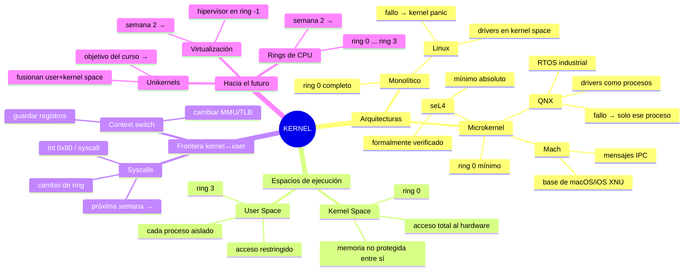

# Día 05 — Repaso semana 1 + mapa mental propio

> **Fase:** 1 · **Semana:** 1 · **Tipo:** Repaso · **Duración:** 30 min

---

## Objetivo del repaso

Esta sesión no introduce conceptos nuevos: su función es **consolidar y conectar** todo lo que has visto en los días 01-04. Al terminar debes ser capaz de explicar, sin mirar notas, qué hace el kernel, por qué Linux y QNX toman decisiones de diseño opuestas y qué implica cruzar la frontera entre user space y kernel space. Esos tres puntos son los pilares sobre los que se construirán las semanas siguientes (syscalls, rings de CPU, virtualización y, finalmente, unikernels).

---

## Mapa mental de la semana

El diagrama siguiente muestra las relaciones entre los conceptos vistos. Lee las flechas como "depende de", "implementa" o "controla", según el contexto.



**Relaciones clave para memorizar:**

```
Kernel monolítico ←→ Microkernel
       |                    |
  todo en ring 0      mínimo en ring 0
  Linux, Solaris      Mach, QNX, seL4
       |                    |
  +rendimiento         +aislamiento
  -resiliencia         -latencia IPC

User space (ring 3)
      |
      | syscall  (cambio ring 3 → ring 0)
      |
Kernel space (ring 0)
      |
      | hardware access
      |
   CPU / RAM / Dispositivos

     UNIKERNEL
  (fusiona ambos espacios →
   objetivo final del curso)
```

---

## Síntesis de cada lección (2-3 líneas por día)

**Día 01 — ¿Qué es un kernel?**
El kernel es el software que media entre el hardware y las aplicaciones: gestiona CPU, memoria, dispositivos y procesos. Sin él, cada programa tendría que hablar directamente con el hierro, lo que haría imposible la multitarea segura. Existen varias familias de kernels según cuánto código vive en modo privilegiado.

**Día 02 — Kernel monolítico: Linux**
En la arquitectura monolítica, todos los subsistemas del OS (sistema de ficheros, drivers, red, gestión de memoria) se ejecutan en un único bloque en ring 0. Esto maximiza el rendimiento porque no hay costes de comunicación entre componentes, pero un bug en cualquier driver puede corromper el espacio del kernel entero y provocar un kernel panic.

**Día 03 — Microkernels: Mach, QNX y seL4**
El microkernel lleva al mínimo el código que corre en ring 0 (solo scheduling, IPC y gestión básica de memoria); el resto (drivers, sistemas de ficheros) son procesos en user space que se comunican por paso de mensajes. Esto otorga aislamiento y resiliencia (un driver defectuoso muere sin arrastrar al sistema) a costa de mayor latencia por las llamadas IPC.

**Día 04 — User space vs kernel space**
La CPU divide el acceso al hardware mediante niveles de privilegio (rings). El kernel corre en ring 0 con acceso total; las aplicaciones de usuario corren en ring 3 con acceso restringido. Cruzar esa frontera requiere una syscall, que suspende la ejecución del proceso, cambia el nivel de privilegio y entrega el control al kernel.

---

## Preguntas de consolidación

Estas preguntas cruzan conceptos de varios días. Intenta responderlas sin mirar el material.

1. **Driver buggy en Linux vs QNX.** Un driver de red tiene un bug de corrupción de memoria. ¿Por qué puede tirar el sistema completo en Linux y no en QNX? Describe exactamente dónde reside ese driver en cada arquitectura y qué ocurre con la memoria cuando el bug se dispara.

2. **De printf a hardware.** Cuando tu programa en C llama a `printf("hola")`, traza todos los pasos que ocurren hasta que los caracteres llegan al terminal: ¿en qué ring corre cada paso?, ¿cuántos cambios de privilegio hay?, ¿qué estructura de datos usa el kernel para saber a qué proceso devolver el control?

3. **seL4 y la verificación formal.** seL4 es el microkernel más pequeño y está formalmente verificado. ¿Qué significa "formalmente verificado" en este contexto? ¿Qué garantiza y qué NO garantiza esa verificación (pista: ¿cubre los drivers?)?

4. **Mach como base de XNU.** macOS usa el kernel XNU, que combina Mach con código de BSD. ¿Es XNU un microkernel puro? Argumenta por qué esta hibridación puede ser un compromiso entre rendimiento y diseño original, y dónde coloca BSD en relación al espacio de privilegio.

5. **Coste del aislamiento.** QNX logra que un driver crasheado no tire el sistema. ¿Cuál es el precio exacto que paga en tiempo de CPU? Describe el mecanismo de IPC y por qué introduce latencia que Linux no tiene.

6. **Kernel panic vs proceso muerto.** En Linux, si un módulo del kernel accede a un puntero nulo, el sistema entra en kernel panic. En un sistema basado en microkernel, el mismo bug produciría como mucho la muerte de un proceso de usuario. Explica la diferencia en términos de qué memoria es accesible desde cada contexto de ejecución.

7. **Rings de CPU y el modelo de privilegio.** La arquitectura x86 define cuatro rings (0-3). Linux solo usa ring 0 y ring 3. ¿Por qué se ignoran los rings 1 y 2 históricamente? ¿Qué cambió con la llegada de la virtualización de hardware (Intel VT-x/AMD-V) que añadió un "ring -1"?

8. **Syscall como contrato.** Las syscalls son la única interfaz oficial entre user space y kernel space en Linux. ¿Qué ventaja de seguridad y mantenibilidad aporta tener esa frontera bien definida? ¿Qué pasaría si un programa pudiera leer la memoria del kernel directamente sin pasar por syscalls?

9. **Unikernel como extremo del espectro.** Sitúa el concepto de unikernel en el espectro que va del kernel monolítico al microkernel. ¿En qué se parece a cada uno? ¿Qué elimina de ambos y para qué escenario tiene sentido esa eliminación?

10. **Diseño y fallos de seguridad.** En 2018, Meltdown y Spectre explotaron la separación entre user space y kernel space a través de la caché de la CPU. ¿Por qué un microkernel puro como seL4 reduciría (pero no eliminaría) la superficie de ataque de Meltdown? ¿Qué propiedad del microkernel ayuda, y qué propiedad del hardware hace que el problema persista?

---

## Conexión con lo que viene

Lo que has aprendido esta semana no es solo historia del OS: es la base mecánica de todo lo que sigue.

**Semana 2 — Syscalls y rings de CPU (días 06-07)**
Cuando en el día 04 viste que cruzar de user space a kernel space requiere una instrucción especial, estabas viendo el inicio de las syscalls. La semana que viene diseccionarás ese mecanismo: cómo funciona la instrucción `syscall` en x86-64, qué guarda la CPU en la pila, qué es la tabla de syscalls del kernel y cómo la MMU cambia de tabla de páginas en cada cambio de contexto. Los rings de CPU dejarán de ser un concepto abstracto para convertirse en un número concreto en un registro de la CPU (CPL en CS).

**Semana 2 — Virtualización (días 08-10)**
La separación kernel/user space que protege los procesos entre sí es el mismo principio que la virtualización lleva un nivel más arriba: el hipervisor corre en ring -1 (VMX root mode) y los kernels de las VMs en ring 0 virtualizado. Entender qué pasa en la frontera kernel/hardware es imprescindible para entender por qué KVM puede ejecutar un kernel Linux sin modificaciones dentro de otro Linux.

**Semana 3 — Unikernels (días 13-15 y más)**
Los unikernels son la consecuencia lógica de la pregunta: "si solo voy a ejecutar una aplicación, ¿por qué necesito la separación user/kernel space?". Esa separación tiene un coste real en ciclos de CPU (cambios de modo, TLB flushes, copias de datos). Los unikernels lo eliminan fusionando la aplicación con el OS en un único espacio de direcciones. Para entender por qué eso es posible, necesitas saber exactamente qué hace esa separación y cuándo deja de ser necesaria; eso es exactamente lo que has estudiado esta semana.

---

## Autoevaluación: ¿estás listo para avanzar?

Responde mentalmente cada punto. Si no puedes responder alguno con confianza, vuelve a la lección correspondiente antes de continuar.

- [ ] **1. Diferencia arquitectural.** Puedo explicar en dos frases por qué en Linux un driver buggy puede causar kernel panic y en QNX no puede, mencionando en qué ring corre cada driver en cada sistema.

- [ ] **2. El camino de una syscall.** Puedo describir, paso a paso, qué ocurre en la CPU cuando un programa llama a `read()`: qué instrucción se ejecuta, qué cambia en los registros de la CPU y cómo el kernel sabe a qué proceso devolver el control.

- [ ] **3. Espacio de memoria.** Puedo explicar qué es el kernel space y el user space en términos de direcciones virtuales, por qué un proceso de usuario no puede leer la memoria de otro proceso, y por qué el kernel sí puede leer la memoria de cualquier proceso.

- [ ] **4. Tres microkernels, tres perfiles.** Puedo diferenciar Mach, QNX y seL4 por su propósito principal (base de OS de propósito general, RTOS industrial, verificación formal) y por al menos una característica técnica distintiva de cada uno.

- [ ] **5. Hacia los unikernels.** Puedo articular en una frase qué elimina un unikernel respecto a un OS convencional y qué trade-off implica esa eliminación, usando como base lo que sé de user/kernel space y rings de CPU.

---

## Notas personales

> Añade aquí tus reflexiones, dudas o conexiones propias al repasar esta semana.

---

*← [Día 04 — User vs kernel space](leccion-04-user-vs-kernel-space.md) · [Día 06 — Syscalls](leccion-06-syscalls.md) →*
